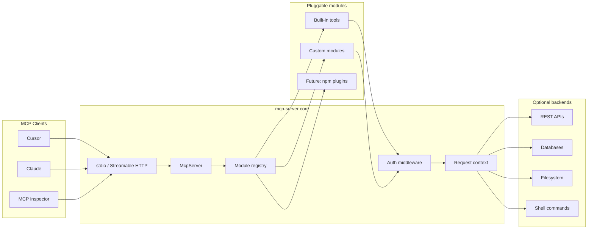

# MCP Server — Build Plan

> Plan for building a **general-purpose** [Model Context Protocol (MCP)](https://modelcontextprotocol.io/) server — a reusable foundation that exposes tools, resources, and prompts to AI clients (Cursor, Claude Desktop, MCP Inspector, etc.), with clear extension points for plugging in any backend or domain logic later.

---

## 1. Goals

### Primary goal

Build a production-quality MCP server **framework** that:

- Runs locally (stdio) and remotely (Streamable HTTP)
- Makes it easy to add new tools, resources, and prompts without touching core transport code
- Validates all inputs/outputs with schemas
- Handles auth, logging, and errors consistently
- Ships with a small set of **generic, useful built-in tools** as reference implementations

### Non-goals (initial phases)

- A product-specific integration (no single SaaS, database, or API baked in)
- A hosted MCP marketplace or registry
- Building an MCP **client** (focus is server-side)
- Supporting deprecated SSE transport

### Success criteria

| Criterion            | Target                                                                  |
| -------------------- | ----------------------------------------------------------------------- |
| Local dev            | `pnpm dev` starts stdio server; Cursor connects in under 5 minutes      |
| Extensibility        | New tool module added in &lt; 30 lines using shared registration helper |
| Built-in tools (MVP) | At least 3 generic tools (e.g. HTTP fetch, JSON transform, time/UUID)   |
| Auth                 | Pluggable auth layer; secrets from env only                             |
| Safety               | Destructive tools opt-in via config; read-only mode supported           |
| Observability        | Structured logs on stderr, request/tool call IDs                        |
| Tests                | Unit tests for registry + handlers; MCP Inspector smoke test            |

---

## 2. What “general-purpose” means

This server is **domain-agnostic**. It provides:

1. **Core runtime** — transport, lifecycle, capability registration, config
2. **Extension system** — modules/plugins that register tools/resources/prompts
3. **Shared utilities** — schema helpers, error formatting, response truncation, auth middleware
4. **Built-in modules** — small, universally useful capabilities (not tied to one product)
5. **Integration patterns** — documented recipes for wrapping REST, GraphQL, gRPC, databases, or local CLIs

Domain-specific servers (e.g. “GitHub MCP”, “Postgres MCP”) become **modules** or separate packages that depend on this.
Width this core — they are not part of the MVP.

---

## 3. Architecture



### Design principles

1. **Core vs modules** — Transport and registration live in core; all domain logic lives in modules
2. **Schema-first** — Every tool uses Zod (or JSON Schema) for input/output validation
3. **Least privilege** — `READ_ONLY=true` disables mutating tools; modules declare `readOnly` metadata
4. **No stdout pollution** — stdio transport logs to stderr only
5. **Composable** — Modules can depend on shared clients (HTTP, cache) injected via context
6. **Fail clearly** — Errors are structured and safe for the model (no stack traces, no secrets)

### Transport strategy

| Transport           | Use case                          | Notes                                                                   |
| ------------------- | --------------------------------- | ----------------------------------------------------------------------- |
| **stdio**           | Local dev, Cursor, Claude Desktop | Primary for Phase 1                                                     |
| **Streamable HTTP** | Remote/hosted deployment          | Phase 3; use `@modelcontextprotocol/hono` with DNS rebinding protection |
| ~~SSE~~             | —                                 | Deprecated; do not implement                                            |

---

## 4. Tech stack

| Layer           | Choice                              | Rationale                                       |
| --------------- | ----------------------------------- | ----------------------------------------------- |
| Runtime         | Node.js 22+                         | Official MCP SDK support; wide deployment       |
| Language        | TypeScript (strict)                 | Type-safe tool schemas and module API           |
| MCP SDK         | `@modelcontextprotocol/server` v1.x | Production-stable; upgrade to v2 when GA        |
| Validation      | Zod                                 | Required peer dep of MCP SDK                    |
| HTTP (remote)   | Hono                                | Lightweight; official MCP middleware available  |
| HTTP client     | `fetch` (native)                    | For built-in HTTP tool and backend integrations |
| Logging         | `pino`                              | Structured JSON; stderr-only in stdio mode      |
| Package manager | pnpm                                | Fast, strict dependency resolution              |
| Testing         | Vitest                              | Unit + integration tests                        |
| Build           | tsup                                | ESM output, bin entry, declaration files        |

---

## 5. Repository structure

```
mcp-server/
├── docs/
│   └── build-plan.md              # this document
├── src/
│   ├── index.ts                   # CLI entry (parse args, start transport)
│   ├── server.ts                  # McpServer factory + instructions
│   ├── config.ts                  # env + CLI flag parsing
│   ├── context.ts                 # per-request context (config, clients, auth)
│   ├── registry/
│   │   ├── index.ts               # registerModules(), list capabilities
│   │   └── types.ts               # McpModule interface
│   ├── transport/
│   │   ├── stdio.ts
│   │   └── http.ts                # Phase 3
│   ├── middleware/
│   │   ├── auth.ts                # API key / bearer / none
│   │   ├── read-only.ts           # block mutating tools when enabled
│   │   └── audit-log.ts           # tool call logging
│   ├── modules/
│   │   ├── index.ts               # compose enabled modules from config
│   │   ├── meta/                  # server info, list_modules
│   │   ├── http/                  # generic HTTP fetch tool
│   │   ├── json/                  # parse, stringify, jq-like pick
│   │   └── datetime/              # now, format, parse ISO
│   ├── resources/                 # static resource providers (Phase 2)
│   ├── prompts/                   # reusable prompt templates (Phase 2)
│   └── lib/
│       ├── errors.ts              # McpError helpers
│       ├── format.ts              # truncate, redact, paginate
│       ├── schema.ts              # shared Zod primitives
│       └── result.ts              # ToolResult builders
├── plugins/                       # optional local plugins (gitignored in prod)
│   └── example/
│       └── index.ts
├── bin/
│   └── mcp-server.js
├── package.json
├── tsconfig.json
├── .env.example
└── README.md
```

---

## 6. Module system

### Module interface

Every capability group implements a single interface:

```typescript
// src/registry/types.ts
import type { McpServer } from "@modelcontextprotocol/server";
import type { ServerContext } from "../context.js";

export interface McpModule {
  /** Unique module id, e.g. "http", "json" */
  id: string;
  /** Human-readable name */
  name: string;
  /** Register tools, resources, prompts on the server */
  register(server: McpServer, ctx: ServerContext): void | Promise<void>;
  /** If true, all tools in this module are blocked when READ_ONLY=true */
  readOnly?: boolean;
}
```

### Registration flow

```typescript
// src/registry/index.ts
export async function registerModules(server: McpServer, ctx: ServerContext, moduleIds: string[]) {
  const modules = resolveModules(moduleIds);
  for (const mod of modules) {
    if (ctx.config.readOnly && mod.readOnly === false) continue;
    await mod.register(server, ctx);
  }
}
```

### Enabling modules

Via env or CLI:

```bash
MCP_MODULES=meta,http,json,datetime   # default set
MCP_MODULES=*                           # all built-in modules
READ_ONLY=true                          # skip mutating modules/tools
```

### Adding a custom module (integration recipe)

1. Create `plugins/my-service/index.ts` implementing `McpModule`
2. Register tools that call your backend via `ctx.http` or injected client
3. Add module id to `MCP_MODULES`
4. Document required env vars in README

No core code changes required.

---

## 7. Configuration

### Environment variables

```bash
# Server
MCP_SERVER_NAME=mcp-server
MCP_SERVER_VERSION=0.1.0
MCP_TRANSPORT=stdio                    # stdio | http
MCP_HTTP_PORT=3100
MCP_MODULES=meta,http,json,datetime
READ_ONLY=false
LOG_LEVEL=info

# Auth (HTTP transport / optional tool gating)
MCP_AUTH_MODE=none                     # none | api_key | bearer
MCP_API_KEY=                           # required when MCP_AUTH_MODE=api_key

# Built-in HTTP tool limits
HTTP_TOOL_ALLOWED_HOSTS=               # comma-separated; empty = block all external
HTTP_TOOL_MAX_RESPONSE_BYTES=1048576   # 1 MB
HTTP_TOOL_TIMEOUT_MS=10000
```

### CLI flags (override env)

```bash
mcp-server --transport stdio --modules meta,http --read-only
mcp-server --transport http --port 3100 --auth api_key
```

---

## 8. MCP capabilities

### 8.1 Built-in tools (MVP)

Generic tools with no domain coupling:

| Tool              | Module   | Description                                               | Read-only    |
| ----------------- | -------- | --------------------------------------------------------- | ------------ |
| `server_info`     | meta     | Name, version, enabled modules, config summary            | yes          |
| `http_fetch`      | http     | GET/POST/PUT/PATCH/DELETE with headers, body, timeout     | configurable |
| `json_parse`      | json     | Parse JSON string; return structured result or error      | yes          |
| `json_stringify`  | json     | Serialize object to formatted JSON                        | yes          |
| `json_pick`       | json     | Extract paths from JSON (lodash-style or JSONPath subset) | yes          |
| `datetime_now`    | datetime | Current time in ISO 860_code and optional timezone        | yes          |
| `datetime_format` | datetime | Format/parsedate strings                                  | yes          |

#### Phase 2 — Additional built-in modules (still generic)

| Module       | Example tools                           | Notes                                            |
| ------------ | --------------------------------------- | ------------------------------------------------ |
| `filesystem` | `read_file`, `list_dir`, `search_files` | Sandboxed to `FS_ROOT` env path                  |
| `shell`      | `run_command`                           | Opt-in; allowlist commands; never default-on     |
| `cache`      | `cache_get`, `cache_set`                | In-memory TTL cache for expensive upstream calls |
| `openapi`    | `openapi_call`                          | Call any REST API from an OpenAPI spec URL       |

### 8.2 Resources (Phase 2)

| URI pattern               | Content                                      |
| ------------------------- | -------------------------------------------- |
| `mcp://docs/build-plan`   | This build plan (embedded or read from disk) |
| `mcp://docs/modules/{id}` | Per-module usage docs                        |
| `mcp://config/schema`     | JSON Schema of server config (for agents)    |

Resources are static or templated — no arbitrary filesystem exposure unless `filesystem` module is enabled.

### 8.3 Prompts (Phase 2)

| Prompt              | Purpose                                                         |
| ------------------- | --------------------------------------------------------------- |
| `explore_api`       | Template for discovering and calling an unknown REST API safely |
| `debug_tool_error`  | Structured checklist when a tool call fails                     |
| `design_new_module` | Guide for adding a new `McpModule` to the server                |

### 8.4 Server instructions

Register once on the server (not repeated in every tool):

- List of enabled modules and read-only mode status
- HTTP tool host allowlist policy
- Datetime format defaults (ISO 8601 UTC)
- Guidance: prefer `http_fetch` only for allowed hosts; never pass secrets in tool args

---

## 9. Tool handler pattern

```typescript
// src/modules/http/fetch.ts
import { z } from "zod";
import type { McpModule } from "../../registry/types.js";
import { toolError, toolText } from "../../lib/result.js";
import { truncate } from "../../lib/format.js";

const inputSchema = z.object({
  url: z.string().url(),
  method: z.enum(["GET", "POST", "PUT", "PATCH", "DELETE"]).default("GET"),
  headers: z.record(z.string()).optional(),
  body: z.string().optional(),
});

export const httpModule: McpModule = {
  id: "http",
  name: "HTTP",
  readOnly: false,
  register(server, ctx) {
    server.registerTool(
      "http_fetch",
      {
        title: "HTTP fetch",
        description: "Fetch a URL. Only allowed hosts are permitted.",
        inputSchema,
      },
      async (args) => {
        if (!ctx.isHostAllowed(args.url)) {
          return toolError("Host not in HTTP_TOOL_ALLOWED_HOSTS allowlist.");
        }
        try {
          const res = await ctx.http.fetch(args.url, {
            method: args.method,
            headers: args.headers,
            body: args.body,
            signal: AbortSignal.timeout(ctx.config.httpTimeoutMs),
          });
          const text = truncate(await res.text(), ctx.config.httpMaxBytes);
          return toolText(`Status: ${res.status}\n\n${text}`);
        } catch (err) {
          return toolError(err);
        }
      },
    );
  },
};
```

### Response conventions

- Return `text` content for human/model consumption; use `structuredContent` when output schema is defined
- Truncate large payloads with `[truncated, N bytes omitted]`
- Redact known secret patterns (Bearer tokens, `api_key=` query params) in responses

---

## 10. Authentication

Auth applies at two layers:

| Layer              | When                 | Options                                                  |
| ------------------ | -------------------- | -------------------------------------------------------- |
| **Transport auth** | Streamable HTTP only | None, API key header, Bearer JWT                         |
| **Tool auth**      | Per-module           | Module reads credentials from `ctx.secrets` (env-backed) |

Rules:

- Secrets never appear in tool input schemas
- `ctx.secrets.get("MY_API_KEY")` loads from env at startup
- Transport auth validates the MCP client; tool auth validates upstream APIs

For stdio (local spawn), transport auth is typically `none` — the OS user boundary is sufficient.

---

## 11. Error handling

| Situation              | MCP response                                 |
| ---------------------- | -------------------------------------------- |
| Zod validation failure | Field-level message from schema              |
| Upstream 401/403       | "Authentication failed for upstream service" |
| Upstream 404           | "Resource not found: {url or id}"            |
| Upstream 429           | "Rate limited; retry later"                  |
| Timeout                | "Request timed out after {N}ms"              |
| Disallowed host        | "Host not in allowlist"                      |
| Read-only violation    | "Tool disabled in READ_ONLY mode"            |

Never return stack traces, env var values, or internal file paths.

---

## 12. Security checklist

- [ ] `HTTP_TOOL_ALLOWED_HOSTS` defaults to empty (deny-all) unless explicitly configured
- [ ] Filesystem module sandboxed to `FS_ROOT`; no path traversal
- [ ] Shell module off by default; command allowlist if enabled
- [ ] Secrets from env only; redaction in logs and tool output
- [ ] Streamable HTTP: Host header validation / DNS rebinding protection enabled
- [ ] CORS restricted when HTTP transport is public
- [ ] `pnpm audit` in CI
- [ ] ESLint rule or script: no `console.log` in `src/` (stdio safety)

---

## 13. Local development

### Prerequisites

- Node.js 22+
- pnpm 9+

### Commands (target)

```bash
pnpm install
cp .env.example .env.local
pnpm dev              # stdio server with default modules
pnpm inspect          # launch MCP Inspector against stdio
pnpm test
pnpm build
pnpm start            # run built bin
```

### Cursor configuration

`.cursor/mcp.json`:

```json
{
  "mcpServers": {
    "mcp-server": {
      "command": "pnpm",
      "args": ["--dir", "/path/to/mcp-server", "dev"],
      "env": {
        "MCP_MODULES": "meta,http,json,datetime",
        "READ_ONLY": "true",
        "HTTP_TOOL_ALLOWED_HOSTS": "api.github.com,httpbin.org"
      }
    }
  }
}
```

Published package:

```json
{
  "mcpServers": {
    "mcp-server": {
      "command": "npx",
      "args": ["-y", "@your-org/mcp-server"],
      "env": {
        "MCP_MODULES": "meta,http,json,datetime",
        "READ_ONLY": "true"
      }
    }
  }
}
```

---

## 14. Testing strategy

| Layer       | What                                                | How                            |
| ----------- | --------------------------------------------------- | ------------------------------ |
| Unit        | Schema validation, redaction, truncation, allowlist | Vitest                         |
| Unit        | Module registration, read-only gating               | Vitest + mock McpServer        |
| Integration | stdio handshake + `tools/list`                      | Spawn process in test          |
| Manual      | Full tool calls                                     | MCP Inspector                  |
| Contract    | Snapshot of tool names/schemas                      | Vitest snapshot on `listTools` |

---

## 15. Implementation phases

### Phase 1 — Core + MVP modules (3–5 days)

- [ ] Scaffold repo: package.json, tsconfig, ESLint, Vitest, tsup
- [ ] Config parsing (env + CLI)
- [ ] `McpServer` factory with server instructions
- [ ] Module registry + `McpModule` interface
- [ ] stdio transport
- [ ] Built-in modules: `meta`, `http`, `json`, `datetime`
- [ ] Error helpers, truncation, host allowlist
- [ ] README + `.env.example` + Cursor mcp.json snippet
- [ ] MCP Inspector smoke test

### Phase 2 — Resources, prompts, more modules (3–5 days)

- [ ] Resource provider for docs/config schema
- [ ] Prompt templates
- [ ] Optional `filesystem` module (sandboxed)
- [ ] Read-only middleware + audit logging
- [ ] Integration test: spawn stdio, call `server_info`

### Phase 3 — Remote deployment (2–4 days)

- [ ] Streamable HTTP transport (Hono)
- [ ] Transport auth (API key)
- [ ] Docker image
- [ ] Publish to npm
- [ ] Deploy runbook (health check, graceful shutdown)

### Phase 4 — Extensibility polish (ongoing)

- [ ] Plugin loader (dynamic import from `plugins/` path)
- [ ] `openapi` module (generate tools from spec)
- [ ] OpenTelemetry metrics
- [ ] CLI scaffolding: `pnpm create-module <name>`
- [ ] Semver releases + changelog

---

## 16. Extension guide (for future domain servers)

When you later need a product-specific server, **do not fork core**. Instead:

1. Create a new package (e.g. `@your-org/mcp-server-github`) that depends on `@your-org/mcp-server`
2. Export one or more `McpModule` implementations
3. Ship a thin bin that passes `MCP_MODULES=meta,http,<your-module>`

Alternatively, add a local plugin under `plugins/` for private integrations.

This keeps the general-purpose core stable while domain logic stays isolated and versioned independently.

---

## 17. Open questions

| #   | Question                                                     | Notes                                    |
| --- | ------------------------------------------------------------ | ---------------------------------------- |
| 1   | Publish as `@zuupee/mcp-server` or neutral scope?            | Naming only; no product coupling in code |
| 2   | Include `filesystem` in MVP or Phase 2?                      | Security review first                    |
| 3   | Support dynamic plugins via npm install, or local path only? | Phase 4 decision                         |
| 4   | OpenAPI module: runtime spec fetch vs codegen tools?         | Tradeoff: flexibility vs type safety     |
| 5   | Multi-tenant HTTP deployment?                                | Session-per-client vs stateless          |

---

## 18. Risks & mitigations

| Risk                             | Impact                    | Mitigation                                    |
| -------------------------------- | ------------------------- | --------------------------------------------- |
| HTTP tool used for SSRF          | Internal network exposure | Deny-by-default host allowlist                |
| Filesystem module path traversal | Data leak                 | Resolve paths under `FS_ROOT`; block `..`     |
| stdio log noise                  | Client disconnects        | Lint + pino to stderr only                    |
| Tool sprawl confuses models      | Poor agent performance    | Modular enablement; clear server instructions |
| Module API churn                 | Broken plugins            | Semver; keep `McpModule` interface minimal    |

---

## 19. References

- [MCP specification](https://modelcontextprotocol.io/)
- [MCP TypeScript SDK (v1)](https://ts.sdk.modelcontextprotocol.io/)
- [MCP server guide (SDK docs)](https://github.com/modelcontextprotocol/typescript-sdk/blob/main/docs/server.md)
- [Cursor MCP configuration](https://docs.cursor.com/context/mcp)
- [MCP Inspector](https://github.com/modelcontextprotocol/inspector)

---

## Appendix A — Example custom module

```typescript
// plugins/acme-api/index.ts
import { z } from "zod";
import type { McpModule } from "../../src/registry/types.js";

export const acmeModule: McpModule = {
  id: "acme",
  name: "Acme API",
  readOnly: true,
  register(server, ctx) {
    server.registerTool(
      "acme_list_items",
      {
        title: "List Acme items",
        description: "Fetch items from the Acme REST API.",
        inputSchema: z.object({ limit: z.number().int().max(50).default(20) }),
      },
      async ({ limit }) => {
        const apiKey = ctx.secrets.require("ACME_API_KEY");
        const res = await ctx.http.fetch(`https://api.acme.example/items?limit=${limit}`, {
          headers: { Authorization: `Bearer ${apiKey}` },
        });
        // ... handle response
      },
    );
  },
};
```

Enable with `MCP_MODULES=meta,http,acme` and `ACME_API_KEY` in env.
