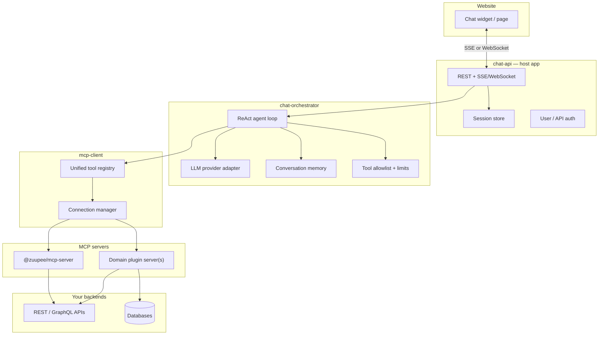

# Website Chatbot — Implementation Plan

> Build plan for a **website chatbot** that uses your data and APIs through **MCP servers as tools**, with **`@zuupee/mcp-client`** and a **custom orchestrator**.

Related docs:

- [MCP Client & Agent Orchestrator — Planning Guide](./mcp-client-and-orchestrator.md)
- [`@zuupee/mcp-server`](../mcp-server/README.md) — tool server framework (already available)

---

## 1. Goals

### Primary goal

Deliver a production-ready chatbot stack where:

- Users chat on a **website** (widget or embedded page)
- A **custom orchestrator** runs the LLM agent loop (tool selection, multi-step reasoning, streaming)
- **`@zuupee/mcp-client`** connects to one or more **MCP servers** that expose your data/APIs as tools
- Domain logic lives in **MCP modules/plugins**, not in the chat UI or orchestrator

### Architecture choice (locked)

| Layer           | Decision                                                                |
| --------------- | ----------------------------------------------------------------------- |
| Tool access     | **MCP servers** (not direct REST calls from orchestrator)               |
| Protocol client | **`@zuupee/mcp-client`** — custom, wraps `@modelcontextprotocol/client` |
| Agent loop      | **Custom orchestrator** — TypeScript, no LangGraph/CrewAI/Cursor SDK    |
| LLM             | Provider SDK (OpenAI or Anthropic recommended for tool-calling)         |

### Non-goals (initial release)

- Multi-agent supervisor / A2A delegation
- OAuth for end-user MCP servers (API key service-to-service only in v1)
- Mobile native apps
- Voice input/output
- Fine-tuned or self-hosted LLMs

### Success criteria

| Criterion       | Target                                                                                     |
| --------------- | ------------------------------------------------------------------------------------------ |
| End-to-end demo | User sends message on website → agent calls MCP tool → grounded reply in &lt; 10s (p95)    |
| Tool surface    | At least 1 domain MCP plugin (e.g. orders, docs, CRM) + `@zuupee/mcp-server` generic tools |
| Streaming       | Token stream + tool-call status events to the browser                                      |
| Safety          | Read-only mode supported; mutating tools behind config flag                                |
| Deploy          | MCP server (HTTP) + chat API + static/widget frontend runnable via Docker Compose          |
| Tests           | Unit tests for orchestrator loop; integration test client → server → tool                  |

---

## 2. System architecture



### Request flow (one user message)

1. Browser sends `POST /chat/sessions/:id/messages` (or streams over WebSocket).
2. **chat-api** loads session history, authenticates user, forwards to orchestrator.
3. **Orchestrator** builds system prompt (persona + MCP server instructions + optional resources).
4. Orchestrator calls **LLM** with unified MCP tool definitions from **mcp-client**.
5. If model returns tool calls → **mcp-client** invokes tools on the right server(s).
6. Tool results appended to messages; loop repeats until model returns text (max N steps).
7. **chat-api** streams assistant text + `tool_start` / `tool_end` events to browser.
8. Session persisted for follow-up turns.

---

## 3. Monorepo layout

Introduce a pnpm workspace at the repo root when implementation starts.

```
.
├── docs/
│   ├── mcp-client-and-orchestrator.md
│   └── chatbot-implementation-plan.md      # this file
├── mcp-server/                               # @zuupee/mcp-server (exists)
├── mcp-client/                               # @zuupee/mcp-client (new)
├── chat-orchestrator/                        # @zuupee/chat-orchestrator (new)
├── chat-api/                                 # @zuupee/chat-api (new)
├── chat-widget/                              # optional: embeddable UI (new)
├── pnpm-workspace.yaml
└── package.json                              # root scripts: dev:chat, docker:chat
```

### Package responsibilities

| Package             | Role                                         | Depends on                     |
| ------------------- | -------------------------------------------- | ------------------------------ |
| `mcp-server`        | Expose tools/resources; domain plugins       | —                              |
| `mcp-client`        | MCP protocol, multi-server, tool namespacing | `@modelcontextprotocol/client` |
| `chat-orchestrator` | ReAct loop, LLM adapter, prompts, limits     | `mcp-client`                   |
| `chat-api`          | HTTP API, sessions, auth, SSE/WebSocket      | `chat-orchestrator`            |
| `chat-widget`       | React/Vanilla embeddable chat UI             | `chat-api` (HTTP only)         |

Keep **orchestrator free of HTTP concerns** and **mcp-client free of LLM concerns** so each layer stays testable in isolation.

---

## 4. Package specifications

### 4.1 `@zuupee/mcp-client`

Thin wrapper over the official SDK. No LLM imports.

#### Public API (target)

```typescript
// config
type McpServerConfig =
  | {
      id: string;
      transport: "stdio";
      command: string;
      args?: string[];
      env?: Record<string, string>;
    }
  | { id: string; transport: "http"; url: string; apiKey?: string };

// connection manager
class McpConnectionManager {
  constructor(servers: McpServerConfig[]);
  connect(): Promise<void>;
  close(): Promise<void>;
  getClient(serverId: string): Client;
  healthCheck(): Promise<Record<string, "ok" | "error">>;
}

// unified tools for orchestrator
class McpToolRegistry {
  constructor(manager: McpConnectionManager);
  refresh(): Promise<void>;
  listTools(): McpToolDefinition[]; // namespaced: "core__http_fetch"
  callTool(namespacedName: string, args: unknown): Promise<ToolResult>;
  getServerInstructions(): string; // merged from all servers
}

// LLM schema adapters
function toOpenAITools(tools: McpToolDefinition[]): OpenAI.Chat.ChatCompletionTool[];
function toAnthropicTools(tools: McpToolDefinition[]): Anthropic.Tool[];
```

#### Tool namespacing

Format: `{serverId}__{toolName}` (e.g. `core__server_info`, `orders__get_order`).

Parse on `callTool` to route to the correct MCP connection.

#### MVP scope

- [x] Stdio + Streamable HTTP transports
- [x] API key header for HTTP (`X-API-Key`, aligned with `mcp-server`)
- [x] `connect`, `listTools`, `callTool`, `listResources`, `readResource`, `close`
- [x] Multi-server config (JSON or env)
- [x] Tool result truncation helper (max bytes → string for LLM context)
- [x] Integration tests against local `mcp-server` (stdio + http)

#### Deferred (post-MVP)

- OAuth `AuthProvider`
- Auto-reconnect with exponential backoff
- `notifications/tools/list_changed` handler
- Elicitation / roots client capabilities

---

### 4.2 `@zuupee/chat-orchestrator`

Custom ReAct loop. Owns all LLM and agent policy logic.

#### Public API (target)

```typescript
type OrchestratorConfig = {
  llm: { provider: "openai" | "anthropic"; model: string; apiKey: string };
  mcp: McpServerConfig[];
  systemPrompt?: string;
  maxToolSteps?: number; // default 10
  toolAllowlist?: string[]; // namespaced tool names; empty = all
  readOnly?: boolean; // block non-read-only tools if server exposes metadata
};

type ChatMessage =
  | { role: "user"; content: string }
  | { role: "assistant"; content: string }
  | { role: "tool"; toolCallId: string; content: string };

type OrchestratorEvent =
  | { type: "text_delta"; delta: string }
  | { type: "tool_start"; name: string; args: unknown }
  | { type: "tool_end"; name: string; result: string; isError: boolean }
  | { type: "done"; message: string }
  | { type: "error"; message: string };

class ChatOrchestrator {
  constructor(config: OrchestratorConfig);
  run(messages: ChatMessage[]): AsyncIterable<OrchestratorEvent>;
  close(): Promise<void>;
}
```

#### Agent loop (pseudocode)

```
1. mcpClient.connect(); registry.refresh()
2. system = basePrompt + registry.getServerInstructions()
3. llmMessages = [system, ...history]
4. tools = registry.listTools() filtered by allowlist
5. loop (step < maxToolSteps):
     response = llm.chat(llmMessages, tools, stream=true)
     if response has tool_calls:
       for each tool_call:
         emit tool_start
         result = registry.callTool(name, args)
         emit tool_end
         append tool result to llmMessages
       continue loop
     else:
       emit text deltas → done
       break
6. if max steps exceeded → emit error with partial summary
```

#### LLM adapter interface

```typescript
interface LlmAdapter {
  complete(params: {
    messages: LlmMessage[];
    tools: unknown[];
    stream: boolean;
  }): AsyncIterable<LlmChunk>; // text deltas + tool_call chunks
}
```

Implement **one provider first** (OpenAI `gpt-4o` or Anthropic `claude-sonnet-4`); add the second in a follow-up phase.

#### Prompts (starter)

- **System:** product persona, tone, “use tools for factual data, don’t invent IDs”
- **Inject:** merged MCP server `instructions` from `mcp-client`
- **Optional:** preload key resources via `readResource` into system context (e.g. API docs URI)

#### MVP scope

- [ ] ReAct loop with streaming text
- [ ] OpenAI **or** Anthropic tool-calling (pick one for v1)
- [ ] `maxToolSteps` guard
- [ ] Tool allowlist
- [ ] Graceful handling of tool errors (return to model as `isError`)
- [ ] Unit tests with mocked LLM + mocked `McpToolRegistry`

---

### 4.3 `@zuupee/chat-api`

HTTP host for the website. Thin layer over orchestrator.

#### Endpoints (MVP)

| Method | Path                          | Purpose                                 |
| ------ | ----------------------------- | --------------------------------------- |
| `POST` | `/chat/sessions`              | Create session; returns `{ sessionId }` |
| `POST` | `/chat/sessions/:id/messages` | Send user message; returns SSE stream   |
| `GET`  | `/chat/sessions/:id/messages` | List history (for page reload)          |
| `GET`  | `/health`                     | Liveness + MCP connection status        |

#### Streaming

Use **Server-Sent Events (SSE)** for MVP (simpler than WebSocket, works through most proxies).

```
event: text_delta
data: {"delta":"Hello"}

event: tool_start
data: {"name":"orders__get_order","args":{"id":"123"}}

event: tool_end
data: {"name":"orders__get_order","isError":false}

event: done
data: {"message":"Your order #123 ships tomorrow."}
```

#### Session store

| Phase | Store           | Notes                 |
| ----- | --------------- | --------------------- |
| MVP   | In-memory `Map` | Single instance only  |
| v1.1  | Redis           | Horizontal scale, TTL |

Persist: `sessionId`, `messages[]`, `createdAt`, optional `userId`.

#### Auth (MVP)

- **Anonymous sessions** with rate limiting by IP (acceptable for public FAQ bot)
- Optional: `Authorization: Bearer <site-api-key>` for server-to-server
- v1.1: integrate with your website auth (JWT → `userId` on session)

#### MVP scope

- [ ] Hono or Express (match `mcp-server` — **Hono** recommended)
- [ ] SSE streaming from orchestrator events
- [ ] CORS configured for your website origin
- [ ] Rate limit middleware (e.g. 20 req/min per IP)
- [ ] Structured logging (pino)
- [ ] Graceful shutdown: close orchestrator → mcp-client

---

### 4.4 `chat-widget` (website UI)

Embeddable chat for your site.

#### MVP scope

- [ ] Floating chat button + message panel
- [ ] `fetch` + `EventSource` for SSE
- [ ] Render user/assistant messages; show “Using tool…” during `tool_start`
- [ ] Config: `data-api-url`, `data-theme` on script tag
- [ ] Build: Vite → single `chat-widget.js` bundle for `<script src="...">` embed

#### Non-goals for MVP

- Markdown rendering (plain text first)
- File uploads
- Multi-tab sync

---

## 5. MCP server strategy (tools for your data/APIs)

The chatbot does **not** call your REST APIs directly. Domain access goes through MCP.

### Server topology

| Server     | Contents                                                          | Transport (dev) | Transport (prod)                          |
| ---------- | ----------------------------------------------------------------- | --------------- | ----------------------------------------- |
| **core**   | `@zuupee/mcp-server` — `meta`, `http`, `json`, `datetime`, `docs` | stdio           | HTTP                                      |
| **domain** | Custom plugin(s) — your business tools                            | stdio           | HTTP (separate container or same process) |

### Domain plugin example (`orders`)

Tools to implement in `mcp-server/plugins/orders/` (or separate deployable):

| Tool           | Description                        | Read-only  |
| -------------- | ---------------------------------- | ---------- |
| `get_order`    | Fetch order by ID from your API    | yes        |
| `list_orders`  | List orders for authenticated user | yes        |
| `cancel_order` | Cancel order                       | no (gated) |

Use `ctx.http.fetch` with allowlisted hosts or inject an internal API client via plugin context.

### Configuration alignment

**Development** (`mcp-client` config):

```json
{
  "servers": [
    {
      "id": "core",
      "transport": "stdio",
      "command": "pnpm",
      "args": ["--dir", "../mcp-server", "dev"],
      "env": { "MCP_MODULES": "meta,http,json,datetime,docs", "READ_ONLY": "true" }
    },
    {
      "id": "orders",
      "transport": "stdio",
      "command": "pnpm",
      "args": ["--dir", "../mcp-server", "dev"],
      "env": { "MCP_MODULES": "meta,orders", "READ_ONLY": "false" }
    }
  ]
}
```

**Production:**

```json
{
  "servers": [
    {
      "id": "core",
      "transport": "http",
      "url": "https://mcp.internal.example/mcp",
      "apiKey": "${MCP_CORE_API_KEY}"
    },
    {
      "id": "orders",
      "transport": "http",
      "url": "https://mcp-orders.internal.example/mcp",
      "apiKey": "${MCP_ORDERS_API_KEY}"
    }
  ]
}
```

See [mcp-server DEPLOY.md](../mcp-server/docs/DEPLOY.md) for HTTP auth and Docker.

---

## 6. Implementation phases

### Phase 0 — Monorepo bootstrap (1–2 days)

- [x] Add `pnpm-workspace.yaml` including `mcp-server`, `mcp-client`, `chat-orchestrator`, `chat-api`
- [x] Shared TS config, ESLint, Node 22+
- [x] Root scripts: `pnpm dev:chat`, `pnpm test`, `pnpm build`
- [x] `.env.example` at root for LLM keys, MCP URLs, CORS origin

**Exit:** `pnpm install` works; empty packages typecheck.

---

### Phase 1 — `mcp-client` MVP (1–2 weeks)

- [x] Scaffold `mcp-client` package (`tsup`, `vitest`)
- [x] Implement `McpConnectionManager` (stdio + HTTP)
- [x] Implement `McpToolRegistry` with namespacing
- [x] Implement `toOpenAITools` (or Anthropic first, matching orchestrator choice)
- [x] Integration tests: connect to `mcp-server`, `callTool("core__server_info")`
- [x] Document config schema in package README

**Exit:** CLI smoke script lists tools from running server.

---

### Phase 2 — Domain MCP plugin (3–5 days)

- [x] Scaffold one domain plugin (e.g. `orders` or `docs`) on `mcp-server`
- [x] Wire to your staging API with `HTTP_TOOL_ALLOWED_HOSTS` or dedicated client in plugin
- [x] Add read-only tools first; one mutating tool behind `READ_ONLY` check
- [x] Test via MCP Inspector and `mcp-client` integration test

**Exit:** `orders__get_order` returns real data from staging API.

---

### Phase 3 — `chat-orchestrator` (1–2 weeks)

- [ ] Scaffold package; define `LlmAdapter` interface
- [ ] Implement OpenAI or Anthropic adapter with streaming + tool calls
- [ ] Implement `ChatOrchestrator.run()` ReAct loop
- [ ] Wire `McpToolRegistry`; enforce `maxToolSteps` and allowlist
- [ ] Unit tests: mock LLM returns tool call → registry called → final text
- [ ] CLI: `pnpm -C chat-orchestrator dev -- "What is my order status for 123?"`

**Exit:** Terminal demo answers using live MCP tools.

---

### Phase 4 — `chat-api` + SSE (1 week)

- [ ] HTTP server with session CRUD
- [ ] `POST .../messages` → SSE stream from orchestrator
- [ ] CORS + rate limiting
- [ ] Health endpoint includes MCP status
- [ ] Integration test: supertest + mock LLM or recorded fixtures

**Exit:** `curl` receives streamed SSE events for a message.

---

### Phase 5 — `chat-widget` + E2E (1 week)

- [ ] Minimal embeddable UI
- [ ] Connect to `chat-api` SSE
- [ ] Tool status indicators
- [ ] Docker Compose: `mcp-server` (http) + `chat-api` + optional static file server for widget demo
- [ ] Manual E2E test checklist

**Exit:** Browser chat on `localhost` calls real MCP tools and streams reply.

---

### Phase 6 — Production hardening (ongoing)

- [ ] Redis session store
- [ ] OTEL traces: chat-api → orchestrator → mcp-client → mcp-server
- [ ] MCP client reconnect + health-based circuit breaker
- [ ] Tool audit log (sessionId, tool name, args hash, latency)
- [ ] Per-environment config (staging/prod MCP URLs)
- [ ] Load test: target p95 &lt; 10s for single-tool queries

---

## 7. Configuration reference

### Environment variables (chat stack)

| Variable                                | Used by      | Description                                   |
| --------------------------------------- | ------------ | --------------------------------------------- |
| `OPENAI_API_KEY` or `ANTHROPIC_API_KEY` | orchestrator | LLM provider                                  |
| `LLM_PROVIDER`                          | orchestrator | `openai` \| `anthropic`                       |
| `LLM_MODEL`                             | orchestrator | e.g. `gpt-4o`, `claude-sonnet-4-20250514`     |
| `MCP_SERVERS_CONFIG`                    | mcp-client   | Path to JSON server list                      |
| `MCP_CORE_API_KEY`                      | mcp-client   | HTTP auth to core server                      |
| `CHAT_CORS_ORIGINS`                     | chat-api     | e.g. `https://www.example.com`                |
| `CHAT_RATE_LIMIT_RPM`                   | chat-api     | Requests per minute per IP                    |
| `CHAT_MAX_TOOL_STEPS`                   | orchestrator | Default `10`                                  |
| `CHAT_TOOL_ALLOWLIST`                   | orchestrator | Comma-separated namespaced tools; empty = all |
| `CHAT_SYSTEM_PROMPT`                    | orchestrator | Override base persona                         |

### Orchestrator defaults (recommended)

| Setting                    | Value                                 | Rationale                                  |
| -------------------------- | ------------------------------------- | ------------------------------------------ |
| `maxToolSteps`             | `10`                                  | Prevent runaway loops                      |
| `toolAllowlist`            | core + domain read tools only in prod | Limit blast radius                         |
| `READ_ONLY` on core server | `true`                                | Generic HTTP fetch not needed in prod chat |
| Tool result max size       | 32 KB → summarize if larger           | Protect context window                     |

---

## 8. Security

| Risk                              | Mitigation                                                                                  |
| --------------------------------- | ------------------------------------------------------------------------------------------- |
| Prompt injection via user message | System prompt rules; tool allowlist; no arbitrary `http_fetch` in prod                      |
| Leaked API keys in browser        | LLM + MCP keys only on server; widget talks to `chat-api` only                              |
| Unauthorized data access          | Pass `userId` from website auth into session; domain plugin validates ownership server-side |
| Mutating tools                    | Off by default; `CHAT_TOOL_ALLOWLIST` excludes write tools in v1                            |
| MCP server compromise             | Network isolate MCP HTTP; API key rotation; read-only DB credentials in plugins             |
| Rate abuse                        | IP rate limits; captcha on session create (v1.1)                                            |
| PII in logs                       | Redact tool args/results in logs; structured log scrubbing                                  |

**Important:** The orchestrator must not trust the model to enforce authorization. **Domain MCP plugins** must check the user/session context on every tool call (inject via env, or future: per-request MCP metadata).

---

## 9. Observability

| Signal  | Where                              | What                                                                      |
| ------- | ---------------------------------- | ------------------------------------------------------------------------- |
| Logs    | chat-api, orchestrator, mcp-client | `sessionId`, `toolName`, latency, errors                                  |
| Metrics | All services                       | `chat_requests_total`, `tool_calls_total`, `llm_tokens`, `mcp_latency_ms` |
| Traces  | OTEL                               | Browser → API → orchestrator → MCP → upstream API                         |

Reuse patterns from [mcp-server OBSERVABILITY.md](../mcp-server/docs/OBSERVABILITY.md).

---

## 10. Testing strategy

| Layer               | Test type        | Focus                                             |
| ------------------- | ---------------- | ------------------------------------------------- |
| `mcp-client`        | Integration      | Real `mcp-server` stdio + http; tool list + call  |
| `chat-orchestrator` | Unit             | Mock LLM + mock registry; step limit; error paths |
| `chat-orchestrator` | Integration      | Live MCP + recorded LLM fixtures (optional)       |
| `chat-api`          | Integration      | SSE event sequence; session persistence           |
| `chat-widget`       | E2E (Playwright) | Send message, receive streamed reply              |
| Domain plugin       | Unit             | Handler logic with mocked upstream API            |

### Critical path smoke test

```bash
# 1. Start MCP server (http)
cd mcp-server && MCP_TRANSPORT=http pnpm dev

# 2. Run mcp-client smoke
pnpm -C mcp-client test:integration

# 3. Run orchestrator CLI against live MCP + real LLM
pnpm -C chat-orchestrator dev -- "Call server_info and summarize"

# 4. Start chat-api + open widget
pnpm dev:chat
```

---

## 11. Deployment topology

### Development

```
Terminal 1: mcp-server (stdio or http)
Terminal 2: chat-api (orchestrator + mcp-client in-process)
Terminal 3: chat-widget dev server
```

### Production (recommended)

```
┌─────────────┐     ┌─────────────┐     ┌──────────────────┐
│  CDN / Web  │────▶│  chat-api   │────▶│  mcp-server(s)   │
│  + widget   │ SSE │  (K8s/ECS)  │ MCP │  HTTP internal   │
└─────────────┘     └──────┬──────┘     └────────┬─────────┘
                           │                      │
                           ▼                      ▼
                      ┌─────────┐           ┌─────────────┐
                      │  Redis  │           │  Your APIs  │
                      └─────────┘           └─────────────┘
```

- **mcp-client** runs inside `chat-api` process (or sidecar if you prefer isolation later).
- MCP servers are **internal only** (no public internet).
- `chat-api` is the only public-facing service besides static assets.

### Docker Compose (MVP demo)

Services: `mcp-core`, `mcp-orders` (optional), `chat-api`, `redis` (optional phase 6).

---

## 12. Timeline estimate

| Phase                  | Duration  | Cumulative |
| ---------------------- | --------- | ---------- |
| 0 — Monorepo bootstrap | 1–2 days  | ~2 days    |
| 1 — mcp-client         | 1–2 weeks | ~2 weeks   |
| 2 — Domain plugin      | 3–5 days  | ~3 weeks   |
| 3 — Orchestrator       | 1–2 weeks | ~5 weeks   |
| 4 — chat-api           | 1 week    | ~6 weeks   |
| 5 — Widget + E2E       | 1 week    | ~7 weeks   |
| 6 — Hardening          | 2+ weeks  | ~9 weeks   |

**MVP (phases 0–5):** ~7 weeks for one engineer, assuming part-time domain API work already exists.

---

## 13. Open decisions (resolve before Phase 3)

| #   | Decision                                | Options                                            | Recommendation                                                                |
| --- | --------------------------------------- | -------------------------------------------------- | ----------------------------------------------------------------------------- |
| 1   | LLM provider for v1                     | OpenAI / Anthropic                                 | Pick whichever your team already uses                                         |
| 2   | One vs two MCP server processes in prod | Monolith modules vs split                          | Single server with multiple modules for MVP; split when scaling               |
| 3   | Anonymous vs authenticated chat         | Public FAQ vs logged-in users                      | Anonymous + rate limit for MVP; JWT in v1.1                                   |
| 4   | User context to MCP tools               | Header injection / tool args / future MCP metadata | Pass `userId` in orchestrator context; plugin reads from secure session store |
| 5   | Widget framework                        | React / Preact / vanilla                           | Vanilla or Preact for smallest embed bundle                                   |

---

## 14. Related reading

| Doc                                                                                                            | Topic                      |
| -------------------------------------------------------------------------------------------------------------- | -------------------------- |
| [mcp-client-and-orchestrator.md](./mcp-client-and-orchestrator.md)                                             | Options and considerations |
| [mcp-server build-plan.md](../mcp-server/docs/build-plan.md)                                                   | Server architecture        |
| [mcp-server WHAT-YOU-CAN-BUILD.md](../mcp-server/docs/WHAT-YOU-CAN-BUILD.md)                                   | Plugin patterns            |
| [mcp-server DEPLOY.md](../mcp-server/docs/DEPLOY.md)                                                           | HTTP deployment            |
| [TypeScript MCP Client Guide](https://github.com/modelcontextprotocol/typescript-sdk/blob/main/docs/client.md) | Official client SDK        |

---

## 15. Summary

Build bottom-up:

1. **`mcp-client`** — protocol layer, multi-server, namespaced tools
2. **Domain MCP plugin** — your data/APIs as tools on `mcp-server`
3. **`chat-orchestrator`** — custom ReAct loop + one LLM provider
4. **`chat-api`** — sessions, SSE, CORS, rate limits
5. **`chat-widget`** — website embed

The website never talks to MCP or the LLM directly. It only talks to **chat-api**, which owns the orchestrator and mcp-client. All business logic stays in **MCP tools**, shared with Cursor and other MCP hosts.
