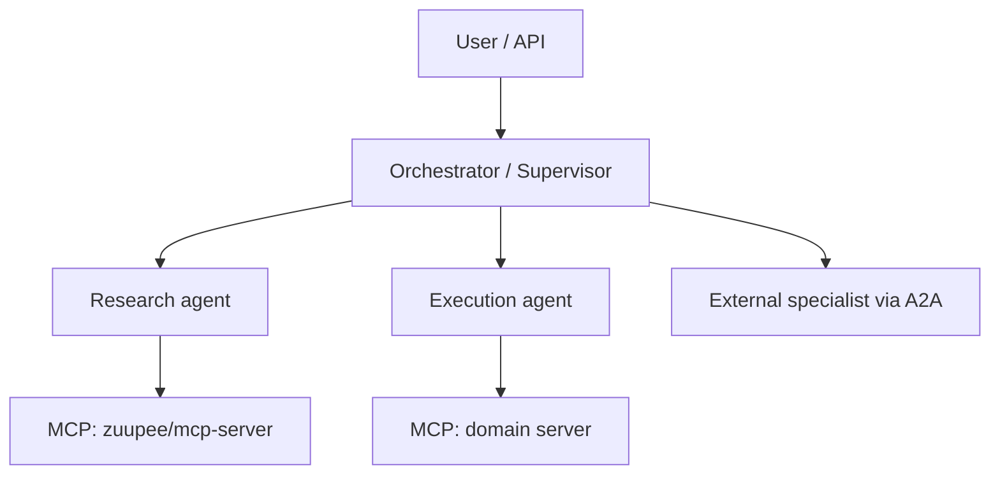

# MCP Client & Agent Orchestrator — Planning Guide

> Considerations and options for building an MCP **client** and/or **agent orchestrator** in the Zuupee monorepo. This complements [`@zuupee/mcp-server`](../mcp-server/) (server-side) and the planned `@zuupee/mcp-client` package.

---

## At a glance

| Layer                  | Responsibility                                                            | Zuupee status                               |
| ---------------------- | ------------------------------------------------------------------------- | ------------------------------------------- |
| **MCP server**         | Expose tools, resources, prompts to clients                               | [`mcp-server/`](../mcp-server/) — available |
| **MCP client**         | Connect to servers, discover capabilities, invoke tools/resources/prompts | `mcp-client/` — planned                     |
| **Agent orchestrator** | Run LLM loops, route tasks, manage multi-step / multi-agent workflows     | Not started                                 |
| **Host application**   | UI, auth, tenancy, deployment (IDE, chat app, API service)                | Out of scope unless you build one           |

An orchestrator **uses** an MCP client (or several). You can build a thin client without an orchestrator, or an orchestrator that embeds client logic — but the concerns differ and are worth separating in design.

---

## 1. Terminology

### MCP client

A library or process that speaks the [Model Context Protocol](https://modelcontextprotocol.io/) on the **client** side:

- Connect via **stdio** (spawn local server process) or **Streamable HTTP** (remote server)
- Run the MCP lifecycle: `initialize` → capability negotiation → `initialized`
- Discover and call **tools**, read **resources**, fetch **prompts**
- Handle **server-initiated requests** (sampling, elicitation, roots) if you declare matching client capabilities
- Authenticate to remote servers (API key, bearer token, OAuth)

The official TypeScript package is `@modelcontextprotocol/client`. Python has an equivalent in the [python-sdk](https://github.com/modelcontextprotocol/python-sdk).

### Agent orchestrator

Software that decides **what to do next** in an AI workflow:

- Sends prompts to an LLM
- Parses tool calls from model output
- Invokes tools (often via MCP) and feeds results back
- Manages conversation state, retries, parallelism, human-in-the-loop
- Optionally coordinates **multiple agents** (planner → worker → reviewer)

Examples: a custom Node service, LangGraph graph, CrewAI crew, OpenAI Agents SDK runner, or the Cursor SDK / Cloud Agents API.

### Host vs client vs orchestrator

| Role             | Example                                                |
| ---------------- | ------------------------------------------------------ |
| **Host**         | Cursor IDE, Claude Desktop, your SaaS chat UI          |
| **MCP client**   | Code inside the host that maintains server connections |
| **Orchestrator** | Agent loop that chooses tools and manages task state   |

Cursor and Claude Desktop are **hosts** with built-in MCP clients and orchestration. If you build `@zuupee/mcp-client`, you are building the client layer; orchestration is a separate (optional) layer on top.

---

## 2. How this fits the Zuupee monorepo

```
┌─────────────────────────────────────────────────────────────┐
│  Host / product (chat UI, API, automation, CI bot)          │
├─────────────────────────────────────────────────────────────┤
│  Agent orchestrator (optional)                              │
│  — LLM loop, multi-agent routing, workflow state            │
├─────────────────────────────────────────────────────────────┤
│  @zuupee/mcp-client (planned)                               │
│  — transports, connection pool, tool/resource adapters      │
├─────────────────────────────────────────────────────────────┤
│  @zuupee/mcp-server + domain plugins                        │
│  — tools, resources, prompts (already built)                │
└─────────────────────────────────────────────────────────────┘
```

**Natural split for `mcp-client`:**

- Thin, reusable MCP protocol client (connection management, discovery, invocation)
- No LLM dependency — keeps it usable from scripts, tests, and any orchestrator

**Natural split for orchestrator (separate package or app):**

- Depends on `mcp-client` + an LLM SDK
- Owns prompts, agent graphs, and product-specific workflow logic

See also: [mcp-server docs — What you can build](../mcp-server/docs/WHAT-YOU-CAN-BUILD.md) (server perspective) and [build-plan.md](../mcp-server/docs/build-plan.md) (server non-goals explicitly exclude client work).

---

## 3. Key considerations

### 3.1 Transport strategy

| Transport           | When to use                                          | Client concerns                                                                              |
| ------------------- | ---------------------------------------------------- | -------------------------------------------------------------------------------------------- |
| **stdio**           | Local dev, single-user, server runs as child process | Process lifecycle (spawn, SIGTERM, zombie cleanup), env inheritance, no network auth         |
| **Streamable HTTP** | Shared/remote servers, Docker/K8s, team deployments  | Sessions (`Mcp-Session-Id`), auth headers, CORS, reconnect, `terminateSession()` on shutdown |
| **SSE (legacy)**    | Older servers only                                   | Deprecated; SDK supports fallback but prefer Streamable HTTP                                 |

`@zuupee/mcp-server` supports stdio and Streamable HTTP with `api_key` / `bearer` auth — design the client to match both.

**Decision:** Will the client primarily connect to **local stdio servers**, **remote HTTP servers**, or **both**? Multi-transport support adds complexity but matches real-world usage (dev vs prod).

### 3.2 Connection lifecycle

- **One client per server** vs **connection pool** per server URL
- **Lazy connect** (on first tool call) vs **eager connect** (at startup)
- **Session stickiness** for HTTP — reuse `Mcp-Session-Id` across requests
- **Graceful shutdown** — `transport.terminateSession()` then `client.close()` for HTTP; stdio must kill child process cleanly
- **Reconnection** — exponential backoff, re-list tools after reconnect (capabilities may change)
- **Health checks** — for HTTP, optional `GET /health` before MCP initialize (server-specific; `@zuupee/mcp-server` exposes this)

### 3.3 Authentication

| Pattern                | Use case                                         | Client implementation                                              |
| ---------------------- | ------------------------------------------------ | ------------------------------------------------------------------ |
| **None**               | Local stdio                                      | No auth layer                                                      |
| **API key / bearer**   | Service-to-service HTTP                          | Static header (`X-API-Key` for `@zuupee/mcp-server`)               |
| **OAuth 2.1**          | User-delegated access to third-party MCP servers | `AuthProvider` with token refresh (`@modelcontextprotocol/client`) |
| **Per-tenant secrets** | Multi-tenant SaaS                                | Secret store + inject into transport per request                   |

Align with server auth: [`MCP_AUTH_MODE`](../mcp-server/README.md) on the server side.

**Security notes:**

- Never log tokens or tool arguments containing secrets
- Stdio `env` in cloud/CI passes secrets into child processes — treat like runtime secrets
- OAuth tokens need secure storage and rotation

### 3.4 Capability discovery & tool surfacing

After connect, the client typically:

1. `listTools()` → expose to LLM as function definitions
2. `listResources()` / `readResource()` → inject context or RAG
3. `listPrompts()` / `getPrompt()` → workflow templates

**Considerations:**

- **Schema mapping** — MCP JSON Schema → OpenAI / Anthropic / Gemini tool formats (orchestrator concern, but client can offer adapters)
- **Tool namespacing** — multiple servers may expose `search`; prefix with server id (`github__search`, `jira__search`)
- **Dynamic refresh** — `notifications/tools/list_changed` (if supported) requires re-listing
- **Server instructions** — `client.getInstructions()` should flow into the system prompt
- **Result size** — truncate or summarize large tool outputs before sending back to the model

### 3.5 Server-initiated requests (bidirectional MCP)

MCP is not strictly request/response. Servers can call back into the client for:

| Server request  | Client capability | Notes                                                                                                |
| --------------- | ----------------- | ---------------------------------------------------------------------------------------------------- |
| **Sampling**    | `sampling`        | Server asks client to complete a prompt (deprecated in spec 2026-07-28; migrate to direct LLM calls) |
| **Elicitation** | `elicitation`     | Server asks user for input (forms, confirmations)                                                    |
| **Roots**       | `roots`           | Filesystem boundary hints                                                                            |

If you only implement tool invocation and ignore these, some servers will fail or degrade. Declare only capabilities you implement.

### 3.6 Error handling & resilience

| Error type               | Typical cause                        | Client behavior                                             |
| ------------------------ | ------------------------------------ | ----------------------------------------------------------- |
| **Connection closed**    | Server crash, network drop           | Retry with backoff; surface degraded state                  |
| **Protocol error**       | Version mismatch, malformed JSON-RPC | Fail fast with clear message                                |
| **Tool execution error** | Business logic failure in server     | Return `isError: true` content to model; don't crash client |
| **Auth failure (401)**   | Expired token                        | Refresh via `onUnauthorized()` once, then fail              |
| **Timeout**              | Slow upstream in tool                | Per-call timeout; cancel in-flight requests                 |

Distinguish **client startup failures** (can't connect) from **tool failures** (connected but tool returned error) — orchestrators need different retry policies.

### 3.7 Observability

Mirror server-side patterns from [OBSERVABILITY.md](../mcp-server/docs/OBSERVABILITY.md):

- Structured logs with `requestId`, `serverId`, `toolName`, latency
- OpenTelemetry traces — propagate `traceparent` / `tracestate` (supported by MCP TypeScript SDK v2)
- Metrics: connect count, tool call rate, error rate, p95 latency per server/tool
- Audit trail for mutating tool calls (who invoked what, when)

### 3.8 Security & governance

- **Tool allowlists** — restrict which tools an agent can call per user/role
- **Read-only mode** — honor server `READ_ONLY` and client-side policy
- **Human approval** — gate destructive tools before `callTool`
- **Sandboxing** — stdio spawns arbitrary commands; validate server config in multi-tenant settings
- **Input validation** — validate tool arguments client-side when schemas are available
- **Rate limiting** — per user, per server, per tool

### 3.9 Multi-server composition

Real agents often connect to several MCP servers at once:

```
Agent
 ├── mcp-client → @zuupee/mcp-server (generic tools)
 ├── mcp-client → github-mcp (domain)
 └── mcp-client → postgres-mcp (domain)
```

**Considerations:**

- Unified tool registry with namespacing
- Independent connection health per server
- Partial failure — agent works if non-critical server is down
- Config format (similar to `.cursor/mcp.json`) for declaring servers
- Parallel `listTools()` at startup

### 3.10 Orchestrator-specific concerns

If you add an orchestrator layer:

| Concern            | Options / notes                                             |
| ------------------ | ----------------------------------------------------------- |
| **LLM provider**   | OpenAI, Anthropic, Gemini, local (Ollama), router           |
| **Agent pattern**  | ReAct loop, plan-and-execute, supervisor, graph (LangGraph) |
| **State**          | In-memory, Redis, DB — conversation + workflow checkpoints  |
| **Streaming**      | Token stream to UI + tool-call events                       |
| **Multi-agent**    | In-process roles vs separate services (A2A protocol)        |
| **Context window** | Summarization, tool result pruning, resource prefetch       |
| **Cost control**   | Model routing, max steps, token budgets                     |
| **Evaluation**     | Golden tasks, LLM-as-judge (DeepEval, etc.)                 |

### 3.11 Deployment topology

| Topology            | Client runs where            | Typical use              |
| ------------------- | ---------------------------- | ------------------------ |
| **Local desktop**   | User machine                 | IDE plugins, CLI agents  |
| **Backend API**     | Your server                  | SaaS agent API, webhooks |
| **CI / automation** | Runner VM                    | PR bots, scheduled jobs  |
| **Cloud agent VM**  | Cursor Cloud / custom worker | Long-running tasks       |

Cursor SDK note: **inline MCP servers are not persisted across `Agent.resume()`** — pass server config again on resume. Same applies if you build a durable orchestrator with checkpointing.

### 3.12 Protocol versioning

The MCP TypeScript SDK is transitioning **v1 → v2** (v2 pre-alpha as of 2026; v1 recommended for production until v2 stabilizes). v2 moves toward more stateless HTTP patterns.

**Recommendation for Zuupee:**

- Pin SDK version explicitly
- Abstract transport behind an interface so v2 migration is localized
- Test against `@zuupee/mcp-server` on the same SDK generation (`@modelcontextprotocol/*` 2.x alpha today)

---

## 4. Options

### 4.1 MCP client implementation options

| Option                                         | Pros                                                   | Cons                                                        | Best for                                |
| ---------------------------------------------- | ------------------------------------------------------ | ----------------------------------------------------------- | --------------------------------------- |
| **A. Official `@modelcontextprotocol/client`** | Spec-aligned, maintained, OAuth helpers, examples      | API still evolving in v2; you build higher-level ergonomics | Default choice for `@zuupee/mcp-client` |
| **B. Thin wrapper over official SDK**          | Zuupee-specific config, multi-server registry, logging | Maintenance burden on wrapper API                           | Zuupee monorepo — recommended           |
| **C. Raw JSON-RPC over HTTP/stdio**            | Full control, minimal deps                             | Reinvent auth, session, schema, errors                      | Not recommended                         |
| **D. LangChain `langchain-mcp-adapters` only** | Fast integration with LangGraph                        | Tied to LangChain; not a general SDK                        | Python orchestrator using LangGraph     |
| **E. Use IDE/host as client**                  | Zero client code (Cursor, Claude Desktop)              | No programmatic control, not embeddable in your product     | Human-in-the-loop dev only              |

**Suggested path for `@zuupee/mcp-client`:** Option B — wrap `@modelcontextprotocol/client` with:

- `McpServerConfig` (stdio | http, auth, env)
- `McpConnectionManager` (connect, reconnect, close)
- `McpToolRegistry` (merge tools from N servers with namespacing)
- Optional adapters: `toOpenAITools()`, `toAnthropicTools()`

### 4.2 Orchestrator implementation options

| Option                                 | Language    | MCP integration               | Strengths                      | Trade-offs                        |
| -------------------------------------- | ----------- | ----------------------------- | ------------------------------ | --------------------------------- |
| **Custom loop**                        | TS / Python | Via `@zuupee/mcp-client`      | Full control, minimal deps     | You own retries, state, streaming |
| **OpenAI Agents SDK**                  | Python / TS | Native MCP server config      | Simple agent + tools           | OpenAI-centric                    |
| **LangGraph + langchain-mcp-adapters** | Python      | Adapter loads MCP tools       | Graphs, cycles, checkpointing  | Python stack; learning curve      |
| **CrewAI**                             | Python      | Native `mcps=[...]` on agents | Role-based teams, quick setup  | Less control for complex graphs   |
| **Cursor SDK**                         | TS / Python | Inline MCP server config      | Production agents, cloud/local | Cursor platform coupling          |
| **Cloud Agents REST API**              | Any         | MCP via API payload           | No SDK language lock-in        | HTTP-only, Cursor-hosted          |
| **Temporal / Inngest + thin agent**    | TS          | MCP client in activities      | Durable workflows              | Heavier infra                     |

### 4.3 Multi-agent / cross-framework options

When one agent must delegate to another (not just call tools):

| Protocol / pattern         | Role                                       | When                                 |
| -------------------------- | ------------------------------------------ | ------------------------------------ |
| **In-process multi-agent** | Planner + workers in one process           | Simple teams, shared memory          |
| **A2A (Agent-to-Agent)**   | Standard agent discovery & task delegation | Cross-framework, cross-vendor agents |
| **MCP**                    | Tool & resource access                     | Vertical integration to data/APIs    |
| **Message queue**          | Kafka, SQS, Redis streams                  | Internal microservices at scale      |

MCP and A2A are complementary: MCP connects agents to **tools**; A2A connects agents to **agents**.

### 4.4 Build vs buy vs host

| Approach                                       | You build                  | You operate                  | Time to value               |
| ---------------------------------------------- | -------------------------- | ---------------------------- | --------------------------- |
| **Cursor / Claude Desktop as host**            | Server only (`mcp-server`) | Desktop app                  | Fastest for dev             |
| **`@zuupee/mcp-client` + custom orchestrator** | Client + workflow          | Your infra                   | Medium; full ownership      |
| **Cursor SDK / Cloud Agents**                  | Integration code           | Cursor cloud or local bridge | Fast for coding agents      |
| **LangGraph / CrewAI**                         | Workflows + MCP adapters   | Your Python backend          | Fast for multi-agent Python |

---

## 5. Reference architectures

### 5.1 Minimal — scripted tool runner (client only)

No LLM. Connect, call tools from code.

```
Script / test
    └── mcp-client.connect(stdio | http)
            └── callTool("http_fetch", { ... })
```

**Use cases:** smoke tests, ETL, ops automation, MCP Inspector-style tooling.

### 5.2 Standard — single-agent ReAct loop

```
User → API → Orchestrator
                 ├── LLM (tool calls)
                 └── mcp-client → [server A, server B, ...]
```

**Use cases:** chat backend, internal copilot, support bot.

### 5.3 Advanced — multi-agent with MCP + optional A2A



**Use cases:** long workflows, specialized sub-agents, cross-framework interop.

---

## 6. Suggested phased plan for Zuupee

### Phase 1 — `mcp-client` MVP

- [ ] Stdio + Streamable HTTP transports
- [ ] API key / bearer auth for HTTP (compatible with `@zuupee/mcp-server`)
- [ ] `connect`, `listTools`, `callTool`, `listResources`, `readResource`, `close`
- [ ] Multi-server config file (JSON) and tool namespacing
- [ ] Integration tests against local `mcp-server` (stdio + http)
- [ ] No LLM dependency

### Phase 2 — Production hardening

- [ ] Reconnection, timeouts, structured logging, OTEL hooks
- [ ] OAuth `AuthProvider` for third-party servers
- [ ] Server-initiated elicitation handler (for interactive flows)
- [ ] Tool result truncation helpers

### Phase 3 — Orchestrator (optional package)

- [ ] Choose stack (custom TS vs LangGraph vs Cursor SDK) based on product
- [ ] ReAct loop with streaming
- [ ] Conversation persistence
- [ ] Tool allowlists and approval gates

### Phase 4 — Multi-agent (if needed)

- [ ] Supervisor pattern or LangGraph graph
- [ ] Evaluate A2A for external agent delegation

---

## 7. Decision checklist

Use this before committing to an architecture.

### Product

- [ ] Who is the user — developer, end customer, internal ops?
- [ ] Is the primary interface an IDE, web chat, API, or batch job?
- [ ] Do you need multi-tenancy and per-tenant MCP server configs?

### MCP client

- [ ] stdio only, HTTP only, or both?
- [ ] How many MCP servers per agent session?
- [ ] Which auth modes must you support day one?
- [ ] Do target servers require client capabilities (elicitation, roots)?

### Orchestrator

- [ ] Single agent sufficient, or multi-agent / supervisor?
- [ ] Which LLM providers?
- [ ] Durable sessions across restarts?
- [ ] Human-in-the-loop approvals required?
- [ ] Build custom vs adopt Cursor SDK / LangGraph / CrewAI?

### Operations

- [ ] Where does the client run (user machine vs your cloud)?
- [ ] Observability stack (logs, traces, metrics)?
- [ ] SLAs for remote MCP servers — health checks, circuit breakers?

### Security

- [ ] Tool allowlists per role?
- [ ] Audit log for mutating operations?
- [ ] Secret management story (env, vault, per-tenant)?

---

## 8. SDK quick reference

### TypeScript — official client (v2-style imports)

```typescript
import { Client, StreamableHTTPClientTransport } from "@modelcontextprotocol/client";
import { StdioClientTransport } from "@modelcontextprotocol/client/stdio";

// HTTP
const client = new Client({ name: "zuupee-client", version: "0.1.0" });
const transport = new StreamableHTTPClientTransport(new URL("http://localhost:3100/mcp"), {
  // authProvider for OAuth; or set headers for API key
});
await client.connect(transport);

const { tools } = await client.listTools();
const result = await client.callTool({ name: "server_info", arguments: {} });

await transport.terminateSession();
await client.close();
```

```typescript
// stdio
const stdioTransport = new StdioClientTransport({
  command: "pnpm",
  args: ["--dir", "/path/to/mcp-server", "dev"],
  env: { MCP_MODULES: "meta,http,json" },
});
await client.connect(stdioTransport);
// client.close() shuts down child process
```

### Connecting to `@zuupee/mcp-server`

| Mode   | Config                                                                    |
| ------ | ------------------------------------------------------------------------- |
| stdio  | Spawn `pnpm dev` or `npx @zuupee/mcp-server`                              |
| HTTP   | `POST http://host:3100/mcp` with `X-API-Key` when `MCP_AUTH_MODE=api_key` |
| Health | `GET http://host:3100/health`                                             |

See [mcp-server README](../mcp-server/README.md) and [DEPLOY.md](../mcp-server/docs/DEPLOY.md).

---

## 9. Related reading

| Resource                                                                                                         | Topic                                      |
| ---------------------------------------------------------------------------------------------------------------- | ------------------------------------------ |
| [modelcontextprotocol.io](https://modelcontextprotocol.io/)                                                      | Specification and concepts                 |
| [TypeScript SDK — Client Guide](https://github.com/modelcontextprotocol/typescript-sdk/blob/main/docs/client.md) | Official client APIs                       |
| [TypeScript SDK v2 docs](https://ts.sdk.modelcontextprotocol.io/v2/)                                             | Evolving v2 API                            |
| [MCP Inspector](https://github.com/modelcontextprotocol/inspector)                                               | Interactive server testing                 |
| [langchain-mcp-adapters](https://github.com/langchain-ai/langchain-mcp-adapters)                                 | MCP → LangChain tools                      |
| [Cursor SDK skill](https://cursor.com/docs/sdk)                                                                  | Programmatic agents with MCP               |
| [A2A protocol](https://google.github.io/A2A/)                                                                    | Agent-to-agent delegation                  |
| [zuupee mcp-server — What you can build](../mcp-server/docs/WHAT-YOU-CAN-BUILD.md)                               | Server capabilities and extension patterns |

---

## 10. Summary

| Build                            | Scope                                 | Recommendation                                                                    |
| -------------------------------- | ------------------------------------- | --------------------------------------------------------------------------------- |
| **`@zuupee/mcp-client`**         | Protocol client, multi-server, no LLM | **Do this** — fills the planned monorepo gap; wrap `@modelcontextprotocol/client` |
| **Custom orchestrator**          | LLM loop + workflow                   | **Do when** you need a product-specific agent API beyond IDE hosts                |
| **Adopt Cursor SDK / LangGraph** | Orchestration                         | **Consider** when time-to-market beats full ownership                             |
| **A2A**                          | Agent-to-agent                        | **Defer** until you have multiple independent agent services                      |

The highest-leverage next step is a thin, well-tested `mcp-client` that mirrors `mcp-server` transport and auth choices. Orchestration can ship later as a separate package that depends on it — keeping protocol concerns separate from LLM workflow concerns.
